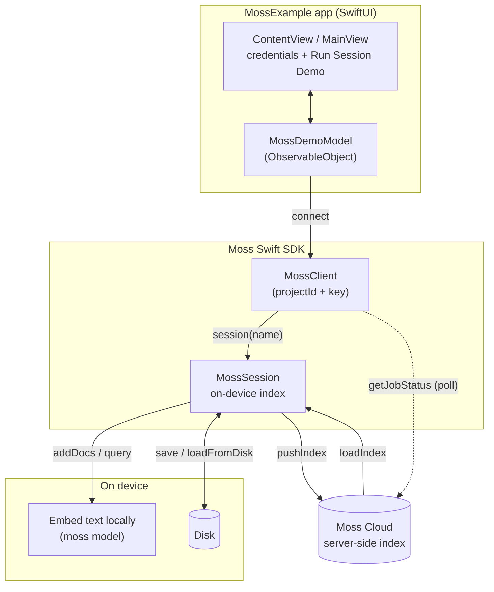

# Moss iOS Example

A SwiftUI app that demonstrates the [Moss Swift SDK](https://github.com/usemoss/moss)
for iOS with an **on-device session**: build an index on-device, push it to
the cloud, and load it back into a fresh session.

The app walks the flow end-to-end, with per-step timing:

`session` → `addDocs` (embedded on-device) → `query` → `deleteDocs` →
`pushIndex` (local → cloud) → poll `getJobStatus` until ready →
`loadIndex` (cloud → a new session) → query

Documents are embedded on-device, and the loaded-back index queries locally.
The push/load steps need network access and valid credentials.

## Architecture



The core session flow (left/bottom) runs entirely on-device. The cloud
round-trip (`pushIndex` / `loadIndex`) is the only part that touches the
network.

## Quick start

The whole API is `async`/`throws`. Build an index on-device, push it to the
cloud, then load it back into a fresh session:

```swift
import Moss

let client = try MossClient(projectId: "your_project_id", projectKey: "your_project_key")
defer { client.close() }

// 1. Build an index on-device.
let session = try await client.session("notes")
try await session.addDocs([
    .init(id: "1", text: "Transformers replaced RNNs for sequence modeling."),
    .init(id: "2", text: "Embeddings map text into vectors for similarity search."),
])

// 2. Push it to the cloud and wait for the job to finish.
let push = try await session.pushIndex()
session.close()
while try await client.getJobStatus(push.jobId).status != "ready" {
    try await Task.sleep(nanoseconds: 1_000_000_000)
}

// 3. Load it back into a new session and query - still on-device.
let restored = try await client.session(push.indexName)
defer { restored.close() }
_ = try await restored.loadIndex(push.indexName)

let hits = try await restored.query("how do transformers work", options: .init(topK: 3))
hits.docs.forEach { print($0.score, $0.id) }
```

See [`MossDemoModel.swift`](MossExample/MossDemoModel.swift) for every call
exercised end-to-end with timing.

### Local persistence (no cloud)

If you don't need the cloud, a session can persist to disk and reopen on the
next launch - fully offline, no network:

```swift
let session = try await client.session("notes")
try await session.addDocs([ /* ... */ ])
try await session.save(toCachePath: NSTemporaryDirectory())
session.close()

// Later, or on the next launch:
let restored = try await client.session("notes")
try await restored.loadFromDisk(cachePath: NSTemporaryDirectory())
let hits = try await restored.query("how do transformers work", options: .init(topK: 3))
```

## Requirements

- iOS 15.1+
- Xcode 15+
- An **Apple Silicon** Mac. The SDK ships arm64 builds only (device and
  simulator); Intel simulators are not supported.
- [XcodeGen](https://github.com/yonaskolb/XcodeGen) to generate the project:
  `brew install xcodegen`

## Get your credentials

Sign up at [moss.dev](https://moss.dev) for a `project_id` and `project_key`
(free tier available), then enter them on the app's first launch. See the
[main Quickstart](https://github.com/usemoss/moss#quickstart) for more.

## The SDK dependency

The app depends on the published Moss Swift package - no local SDK checkout
needed. The dependency is declared in [`project.yml`](project.yml):

```yaml
packages:
  Moss:
    url: https://github.com/usemoss/moss
    from: 0.3.0
```

On first build, Xcode downloads the precompiled `Moss.xcframework` from the
[v0.3.0 release](https://github.com/usemoss/moss/releases/tag/v0.3.0),
verifies its checksum, and links it in.

## Generate the project

```bash
cd examples/ios
xcodegen generate
open MossExample.xcodeproj
```

Re-run `xcodegen generate` whenever you edit `project.yml`.

## Run

### Xcode

Open `MossExample.xcodeproj`, pick an **iPhone 15+** simulator on Apple
Silicon (or a connected device - set your team under **Signing &
Capabilities**), and hit ▶.

### Command line

`generic/platform=iOS Simulator` builds for the simulator without pinning a
specific device, so it works regardless of which simulators you have
installed:

```bash
xcodebuild -project MossExample.xcodeproj \
  -scheme MossExample \
  -destination 'generic/platform=iOS Simulator' \
  -configuration Debug \
  ARCHS=arm64 ONLY_ACTIVE_ARCH=YES build
```

To target a specific simulator instead, pass e.g.
`-destination 'platform=iOS Simulator,name=iPhone 17 Pro'` - run
`xcrun simctl list devices available` to see what's installed.

## Using it

1. **First launch** shows a credentials screen. Enter the `project_id` and
   `project_key` from [moss.dev](https://moss.dev) (see
   [Get your credentials](#get-your-credentials)) - they authenticate the client.
2. Tap **Run Session Demo** to walk the full flow - build on-device, push to
   the cloud, then load back. The log shows each step and its timing.

## Code tour

| File | What it shows |
| --- | --- |
| [`MossDemoModel.swift`](MossExample/MossDemoModel.swift) | Every SDK call, narrated step-by-step. Start here. |
| [`ContentView.swift`](MossExample/ContentView.swift) | SwiftUI wiring - credentials screen and the demo button. |
| [`MossExampleApp.swift`](MossExample/MossExampleApp.swift) | App entry point. |

## Credentials in production

To keep the sample short, it stores the project key in `@AppStorage`. For a
production app, use the `Authenticator` protocol instead: your app fetches a
short-lived token from your own backend, so the long-lived project key stays
on your server rather than shipping in the binary.

```swift
final class MyAuth: Authenticator {
    func getAuthHeader() async throws -> String {
        try await myServer.fetchMossToken()
    }
}

let client = try MossClient(projectId: id, authenticator: MyAuth())
```
